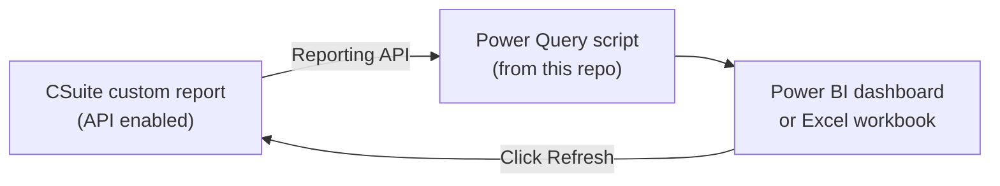

# CSuite → Power BI & Excel: Raw Data API Tools

**Pull your Foundant CommunitySuite (CSuite) report data directly into Power BI or Excel — automatically, with no exporting, no CSV files, and no software to install.**

This repository contains ready-to-use **Power Query templates** for community foundation staff. You copy a script, paste it into Power BI or Excel, fill in four values from CSuite, and your custom report data flows in — and refreshes on demand — from then on.

No programming experience is required. If you can build a custom report in CSuite and copy-and-paste, you can use these tools.

---

## Why would I want this?

If you report out of CSuite today, this routine probably looks familiar:

1. Log in to CSuite
2. Navigate to the correct custom report
3. Run it and export to CSV
4. Open the CSV, copy the data
5. Paste it into your "real" Excel workbook or refresh your Power BI file
6. Repeat every week/month/quarter... for every report

These templates eliminate steps 1–5. Once set up, your Excel workbook or Power BI report connects **directly** to the CSuite reporting API and pulls the current data every time you hit **Refresh**.

This is especially powerful because CSuite custom reports can't join across objects (for example, one report showing both Donations *and* Grants). With these templates you can pull several CSuite reports into one Power BI or Excel file and combine them there — no more VLOOKUP-ing between exported CSVs.

## How it works

1. In CSuite, you **enable the API** on any custom report. CSuite gives you a set of access keys for that report.
2. You paste one of the templates from this repo into Power BI or Excel and fill in your keys.
3. From then on, refreshing your file re-runs the CSuite report and pulls in the latest data.

The templates use CSuite's **"Raw" Report API**, which returns report data over the web in a standard format (JSON). Power Query — built into both Power BI and Excel — handles all of that for you.

## Which template do I use?

| File | Use it with | Notes |
|------|-------------|-------|
| [PowerBITemplate.txt](PowerBITemplate.txt) | **Power BI** | Written to be "refresh-safe," so scheduled refresh keeps working after you publish to the Power BI Service. |
| [ExcelTemplate.txt](ExcelTemplate.txt) | **Excel** (desktop) | Simpler version for Excel's built-in Power Query. |

Both templates call the same Raw Report API and need the same four values from CSuite.

## Get started

Setup takes about 15 minutes the first time:

1. **[Get your API credentials from CSuite](docs/getting-your-api-credentials.md)** — enable the API on a custom report and copy four values (do this first, whichever tool you use)
2. **[Power BI step-by-step guide](docs/powerbi-guide.md)** — paste the template, load your data, publish, and set up scheduled refresh
3. **[Excel step-by-step guide](docs/excel-guide.md)** — paste the template and load your data into a worksheet

### What you'll need

- A CSuite login that can view the **Reports** page and enable a report's API (ask your CSuite admin if you're not sure)
- A saved **custom report** in CSuite containing the data you want
- **Power BI Desktop** ([free download](https://www.microsoft.com/en-us/download/details.aspx?id=58494)) or desktop **Excel** (Power Query is not available in Excel for the web)

> [!WARNING]
> **The API keys are passwords.** Anyone who has a report's SIGNER and SIGNATURE values can pull that report's data — no CSuite login required. Don't email the keys, post them in chat, or commit them to a shared repository, and be thoughtful about which reports you API-enable. See the [credentials guide](docs/getting-your-api-credentials.md#keep-your-keys-safe) for details.

## Isn't there an official Power BI Connector?

Yes — Foundant also offers a downloadable **Power BI Connector** (see [Foundant's support article](https://support.foundant.com/hc/en-us/articles/25345593729175-Power-Bi)). Both approaches work; here's how they compare:

| | Official Power BI Connector | These templates (Raw API) |
|---|---|---|
| Software install | Requires downloading a connector file and running a registry update on each PC | None — just copy and paste |
| Works in Excel | No — Power BI only | Yes |
| Reports with "Array" type fields | Not supported (report will fail) | Handled — list values are converted to comma-separated text |
| Scheduled refresh in Power BI Service | Requires extra setup | Works (using the refresh-safe template) |

If your IT department prefers officially packaged connectors, use Foundant's. If you want the fastest path — or you're working in Excel — use these templates.

## What's in this repo

| Path | What it is |
|------|------------|
| [PowerBITemplate.txt](PowerBITemplate.txt) | Power Query template for Power BI |
| [ExcelTemplate.txt](ExcelTemplate.txt) | Power Query template for Excel |
| [docs/](docs/) | Step-by-step guides (start here!) |
| [Resources/](Resources/) | Presentation deck: *CSuite Reporting APIs* (August 2025) — a walkthrough of these concepts in slide form |

## Getting help

These tools were created by **Mitch Hollberg** ([mitch@morrisonanalytics.com](mailto:mitch@morrisonanalytics.com) / [mhollberg@gmail.com](mailto:mhollberg@gmail.com)) — questions, suggestions, and success stories are all welcome. You can also [open an issue](../../issues) on this repository.

For questions about CSuite itself (reports, permissions, the API feature), contact [Foundant Support](mailto:support@foundant.com).

## License

Released under the [MIT License](LICENSE) — free to use, copy, and adapt at your foundation.
